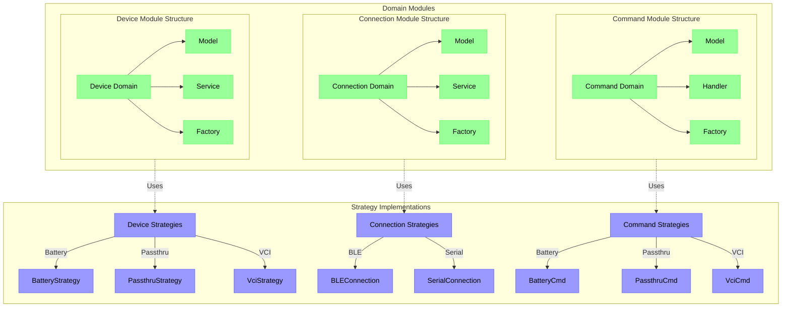
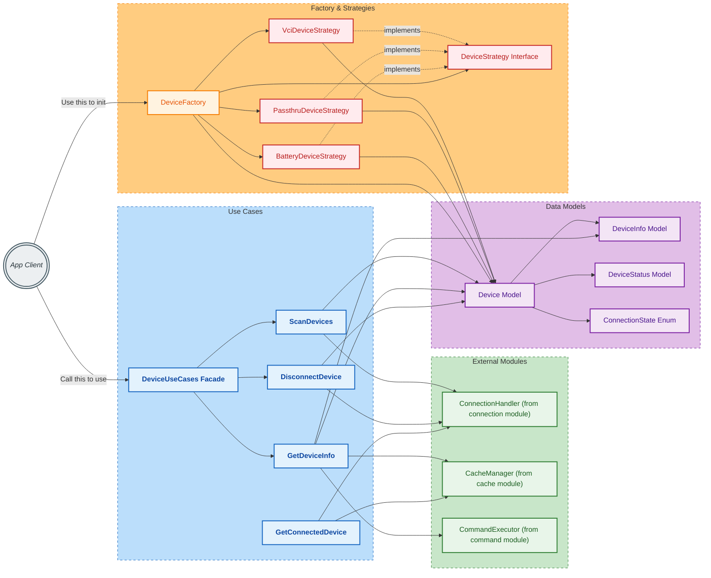

# SDK Core Issues and Improvement Suggestions 

The content bellow is **NOT** AI Generated, only AI Assisted/Argument/Layout/Rephrase.

## 1. Should Implement DDD Principles

The current SDK design does not fully adhere to Domain-Driven Design (DDD) principles. By implementing DDD, we can better organize the codebase around the core business logic and domain models, leading to improved maintainability and scalability. This involves defining clear boundaries for different domains, using aggregates to encapsulate related entities, and employing repositories for data access.

Because the lack of DDD, the current project also have many issues:

- Why we have `com.innova.sdk_core.utils` and `com.innova.sdk_utils`, which are utility packages but located in different modules? This may cause confusion about where to find utility functions and lead to code duplication.

- Why we need to centralize all model into this `com.innova.sdk_models` package? This may lead to a bloated models package that is hard to navigate and maintain. Instead, we should consider organizing models according to their respective domains.

- And what is the purpose of `CommunicationInterface` in package `com.innova.sdk_com.interfaces` when we already have `com.innova.sdk_core.interfaces`?

These are only some examples of the confusion caused by the current structure.

By using DDD + Factory Pattern + Strategy Pattern + Facade Pattern, we will have this structure:

### Tree Structure

```markdown
com.innova.sdk_core/
├── devide/
│   ├── domain/
│   │   ├── model/
│   │   │   └── Device.kt
│   │   └── service/
│   │       ├── DeviceService.kt
│   │       └── impl/
│   │           ├── ScanDevices.kt
│   │           └── GetConnectedDeviceInfo.kt
│   ├── strategy/
│   │   ├── <<DeviceStrategy>>.kt
│   │   ├── BatteryDeviceStrategy.kt
│   │   ├── PassthruDeviceStrategy.kt
│   │   └── VciDeviceStrategy.kt
│   └── factory/
│       └── DeviceFactory.kt
├── connection/
│   ├── domain/
│   │   ├── model/
│   │   │   ├── ConnectionConfig.kt
│   │   │   ├── ConnectionError.kt
│   │   │   ├── ConnectionResult.kt
│   │   │   └── ConnectionState.kt
│   │   └── service/
│   │       ├── ConnectionService.kt
│   │       └── impl/
│   │           ├── EstablishConnection.kt
│   │           └── TerminateConnection.kt
│   ├── strategy/
│   │   ├── <<ConnectionStategy>>.kt
│   │   ├── BLEConnectionStrategy.kt
│   │   └── SerialConnectionStrategy.kt
│   └── factory/
│       └── ConnectionFactory.kt
├── command/
│   ├── domain/
│   │   ├── model/
│   │   │   ├── CommandRequest.kt
│   │   │   ├── CommandResponse.kt
│   │   │   ├── CommandResult.kt
│   │   │   └── CommandExeption.kt
│   │   └── handler/
│   │       ├── CommandBuilder.kt
│   │       ├── CommandExecutor.kt
│   │       └── CommandValidator.kt
│   ├── strategy/
│   │   ├── <<CommandStrategy>>.kt
│   │   ├── PassthruCommandStrategy.kt
│   │   ├── VciCommandStrategy.kt
│   │   └── BatteryCommandStrategy.kt
│   └── factory/
│       └── CommandFactory
├── commandQueue/
│   └── domain/
│       ├── model/
│       │   ├── CommandQueueTimeout.kt
│       │   ├── CommandQueueItem.kt
│       │   └── CommandQueueException.kt
│       └── service/
│           └── CommandQueueService.kt
├── database/
│   └── domain/
│       ├── model/
│       │   ├── QueryResult.kt
│       │   ├── DatabaseConfig.kt
│       │   └── DatabaseInfo.kt
│       └── service/
│           ├── DatabaseService.kt
│           └── impl/
│               ├── EstablishDatabaseConnection.kt
│               ├── GetDatabaseVersion.kt
│               ├── DisconnectDatabase.kt
│               ├── FetchQuery.kt
│               └── QueryRecord.kt
├── cache/
│   └── domain/
│       ├── model/
│       │   ├── CacheEntry.kt
│       │   └── CacheConfig.kt
│       └── service/
│           ├── CacheService.kt
│           └── impl/
│               ├── GetCacheData.kt
│               ├── SetCacheData.kt
│               └── ClearCache.kt
├── battery/
│   ├── domain/
│   │   └── model/
│   │       └── Vbat.kt
│   ├── service/
│   │   ├── BatteryService.kt
│   │   └── impl/
│   │       ├── GetVBat.kt
│   │       ├── HandleAltornatorTest.kt
│   │       └── HandleBatteryTest.kt
│   ├── strategy/
│   │   ├── <<BatteryStrategy>>.kt
│   │   ├── PassthruBatteryStrategy.kt
│   │   ├── BatteryBatteryStrategy.kt
│   │   └── VciBatteryStrategy.kt
│   └── factory/
│       └── BatteryFactory.kt
├── obd2/
│   ├── domain/
│   │   ├── Obd2Dtc.kt
│   │   ├── Obd2LiveDataItem.kt
│   │   ├── Obd2FreezeFrame.kt
│   │   └── ...
│   ├── parser/
│   │   ├── DecodeVin.kt
│   │   ├── Obd2DtcParser.kt
│   │   └── ...
│   ├── service/
│   │   ├── Obd2Service.kt
│   │   └── impl/
│   │       ├── GetVin.kt
│   │       ├── GetRPM.kt
│   │       ├── GetVSS.kt
│   │       ├── GetMode05.kt
│   │       ├── GetMode06.kt
│   │       ├── GetMode08.kt
│   │       ├── GetMode09.kt
│   │       ├── CheckPidSupport.kt
│   │       ├── GetLiveDate.kt
│   │       ├── GetLedLogic.kt
│   │       └── ...
│   ├── strategy/
│   │   ├── <<Obd2Strategy>>.kt
│   │   ├── PassthruObd2Strategy.kt
│   │   └── VciObd2Strategy.kt
│   └── factory/
│       └── Obd2Factory.kt
├── ===Need to research nws structure more===
├── nws/
│   ├── domain/
│   │   ├── model
│   │   └── service
│   ├── oem/
│   │   └── domain/
│   │       ├── model/
│   │       │   ├── Module.kt
│   │       │   ├── OemDtc.kt
│   │       │   ├── System.kt
│   │       │   ├── SubSytem.kt
│   │       │   ├── ScanningStatus.kt
│   │       │   ├── LinkingStatus.kt
│   │       │   └── OemEraseStatus.kt
│   │       ├── parser/
│   │       │   └── OemDtcParser.kt
│   │       └── service/
│   │           ├── OemService.kt
│   │           └── impl/
│   │               ├── GetListSystem.kt
│   │               ├── CheckSupport.kt
│   │               ├── ScanSystem.kt
│   │               ├── EraseSystem.kt
│   │               └── ...
│   ├── ofm/
│   │   └── domain/
│   │       └── model/
│   │           ├── ServiceCheck.kt
│   │           └── WarningLight.kt
│   ├── ld/
│   │   └── domain/
│   │       ├── model/
│   │       │   ├── NwsLiveDataItem.kt
│   │       │   └── NwsLiveDataPid.kt
│   │       └── service
│   ├── strategy/
│   │   ├── <<NwsStrategy>>.kt
│   │   ├── PassthruNwsStrategy.kt
│   │   └── VciNwsStrategy.kt
│   └── factory/
│       └── NwsFactory
├── vehicle/
│   └── domain/
│       ├── model/
│       │   ├── Vin.kt
│       │   ├── Ymme.kt
│       │   └── Odo.kt
│       └── service/
│           ├── VehicleService.kt
│           └── impl/
│               ├── GetVehiclesHistory.kt
│               ├── GetCurrentVehicleInfo.kt
│               └── ...
├── upgrade/
│   ├── domain/
│   │   ├── model/
│   │   │   ├── UpgradeType.kt
│   │   │   ├── FirmwareInfo.kt
│   │   │   └── BootloaderInfo.kt
│   │   └── service/
│   │       ├── UpgradeService.kt
│   │       └── impl/
│   │           ├── StartUpgrade.kt
│   │           └── Reboot.kt
│   ├── strategy/
│   │   ├── <<UpgradeStrategy>>.kt
│   │   ├── PassthruUpgradeStrategy.kt
│   │   ├── BatteryUpgradeStrategy.kt
│   │   └── VciUpgradeStrategy.kt
│   └── factory/
│       └── UpgradeFactory.kt
├── utils/
│   └── converter/
│       ├── Byte.kt
│       ├── Dec.kt
│       ├── Hex.kt
│       └── String.kt
├── coreManager.kt      #DO NOT handle logic here, DI only
└── ...
 ```

### Implement Diagram



### Example Relationship of device module



## 2. Reconsider external database

### **Security:**

- The implement of internal databases may have difficulties and not realistic necessarily. When client have the sdk aar file, they can just change the file to .jar and extract it like a normal zip file. So the internal database may not be secure enough. 
- More over, the database service can not use .db file directly, it need to copy the file to local storage first, which may cause performance issue and go against the purpose of internal db.

### 
